
# 普日软件微信企业号现场实施操作手册
#### 作者：王贺
##### 版权所有©沈阳普日软件技术有限公司
目录
------
###[1. 微信客户端简介](#weixinpj)
###[2. 微信客户端部署 - 创建应用](#pubCreate)
###[3. 微信客户端部署 - 创建管理员账户并授权](#pubAdmin)
###[4. 微信客户端部署 - 通讯录组织结构以及导入导出](#pubContact)
###[5. 微信客户端部署 - xxxqyweixinoa微信工程的配置文件](#weixincon) 
###[6. 微信客户端部署 - home工程的配置文件](#homecon)
###[7. 微信客户端部署 - messagemanagement工程的配置文件](#msgcon)
###[8. 微信客户端部署 - mobile-platform工程的配置文件](#platformcon)
###[9. 通过企业协同管理平台同步到微信企业号通讯录](#synchronization) 
###[10. 微信客户端部署注意事项](#attention)
    
微信工程
===

微信客户端简介
--
###微信客户端是一个独立的web工程项目，主要实现了OA系统内嵌到微信企业号的部分功能，主要包括：待办工作，查询列表以及相关消息推送等功能。用户可以在微信端完成OA系统中的审批，查询等操作。微信客户端采用jQuery-Mobile作为前台开发语言，其原理与jQuery基本一致，而后台部分采用springMVC架构，通过http请求与服务端(mobile-platform)接口进行json格式的数据交互。通过https与微信服务端接口进行约定格式的数据交互。所以从技术角度上说与普通的web工程并没有太大的区别。仅有的区别就是与微信服务端的交互。这部分代码已经完成，不需要再次开发。实施人员在部署项目时进行相关的操作，配置相关的参数就可以使微信客户端能够正常运行。

- 对于开发人员：可以参考[知识库中的微信目录](https://github.com/propersoft-cn/proper-knowledge-base/tree/master/archives/docs/DEV/%E5%BE%AE%E4%BF%A1%E5%BC%80%E5%8F%91)中的【微信企业号开发详细文档.xlsx】，里面详细介绍了各个功能相关代码的示例和解析。所以可以说对于任何一个开发者来说都可以进行微信项目的开发，并不存在技术上的跨域。

- 对于实施人员：请根据本文档的说明信息进行操作，了解[微信客户端部署注意事项](#attention)。如果遇到问题请优先参考本文档。尽量运用自己的能力分析和解决问题，而不是直接找相关开发人员进行部署。如果仍有解决不了的问题再联系相关开发人员。按照要求，需要以邮件抄送相关人员和负责人提出在实施过程中遇到的具体问题。开发人员根据具体的问题更新文档或给出建议。
 
###微信客户端总体架构模型图如下所示：
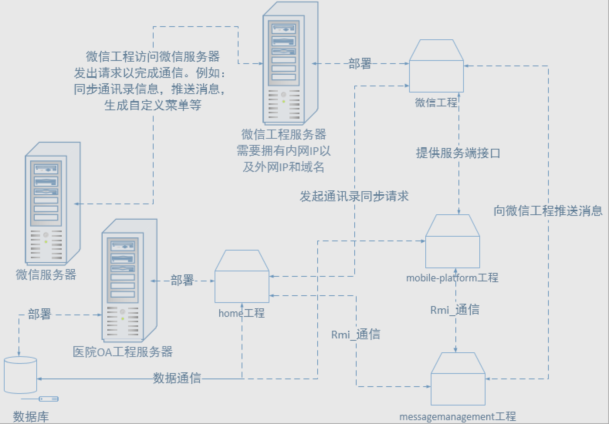
 
###微信客户端需要一台服务器，基本要求如下：

- 64位的操作系统，内存4G以上，硬盘80G以上，cpu在Intel处理器i3或同级别以上，服务器配置越高越好。
 
- 同时拥有内网IP和公网IP（公网IP是指能够从外网环境进行访问的IP地址）
 
- 服务器的公网IP需要绑定到域名上

- 服务器80端口不能被占用
 
###微信客户端所依赖的工程项目如下（请实施人员确认提供给现场的部署文件是否有缺失）：

- xxxweixinqyoa微信客户端工程：微信客户端工程。（xxx是各个项目具体的微信客户端前缀）

- home工程：此工程与微信相关的主要功能是在WEB版OA系统进行人员信息维护时与微信企业号通讯录进行同步更新。
 
- messagemanagement工程：此工程主要功能为推送各种类型的消息给用户。
 
- mobile-platform工程：此工程为移动端服务工程。（如果需要启用APP应用则需要部署到有公网IP的服务器中）

- 如果是APP需要同样上线则需要另外的服务工程作为支持，分别为properPush工程和DDpush工程。

- 建议将微信工程单独放在一台服务器中，其他工程放在home的服务器中

###微信客户端实施参考步骤：

1.申请微信企业号

2.申请服务器（配置参考上文），需要内网IP和公网IP

3.将服务器的公网IP绑定到域名下（如果客户没有域名可以考虑暂挂在我们自己的二级域名下）

4.微信企业号创建应用

5.微信企业号创建管理员并授权

6.通讯录，如果是新上线的系统，可以跳过此步骤（因为配置好微信后，当用户在home工程中操作人员信息时会把人员信息同步到微信企业号的通讯录中）。如果客户已有通讯录，需要先将原组织架构的通讯录导出，整理后再导入到根组织架构中（注意：要重视微信工程中部门ID的设置（参照[微信端部署](#weixincon)中的关于部门ID的说明），如果OA系统中已经存在的用户需要导入，OA系统中还没有录入的用户不需要导入，因为操作人员信息时会进行同步）

7.部署xxxweixinqyoa微信客户端工程，进行回调模式的验证。（如有疑问，请参照[微信客户端部署注意事项](#attention)）

8.部署home工程，部署messagemanagement工程，部署mobile-platform工程。（注：如果需要APP应用则需要启动另外两个相关工程）

9.管理员关注企业号,在企业微信号客户端，管理员输入"createMenu"创建菜单，如果收到"创建菜单成功"则表示创建菜单成功

10.已关注微信企业号的人员进入企业号应用并点击菜单进行操作，验证微信企业号内数据能否正常显示。

11.发送邮件或待办验证微信企业号推送功能。

12.操作home人员信息，进行人员信息微信企业号通讯录确认。

  [回到首页](#home)

微信客户端部署 - 创建应用
===

说明
--
####登录微信企业号后，点击应用中心，然后点击"+"号。
 *此步骤操作只能用权限最大的创建人操作，其他管理员账号不能创建应用
 
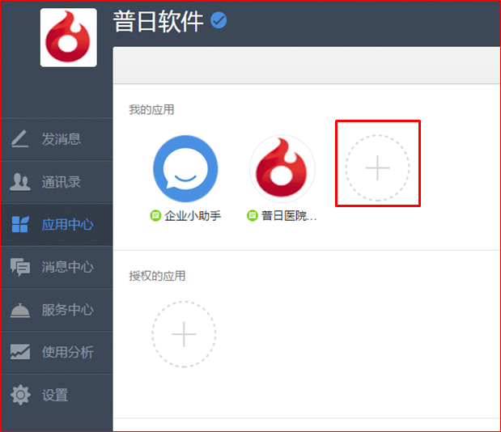
####选择【消息型应用】
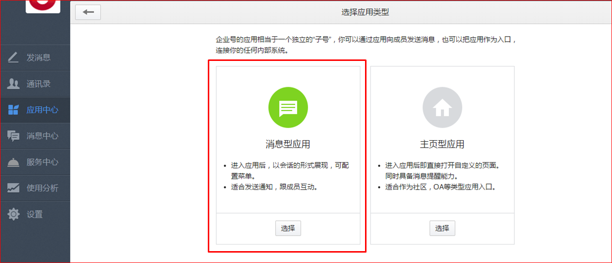
####填写应用信息
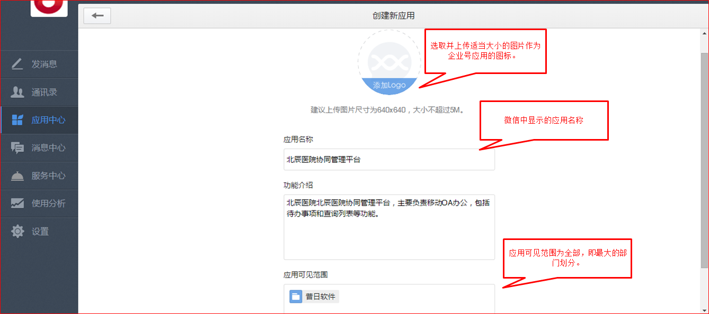
####成功创建应用
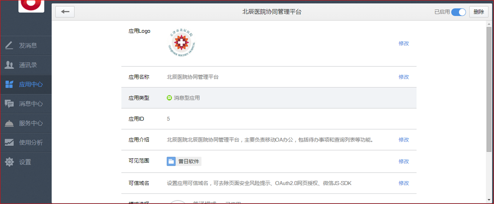

  [回到首页](#home)

微信客户端部署 - 创建管理员账户
===

说明
--
####用申请账户登录微信企业号后，点击【通讯录】，然后点【+】->【新增人员】
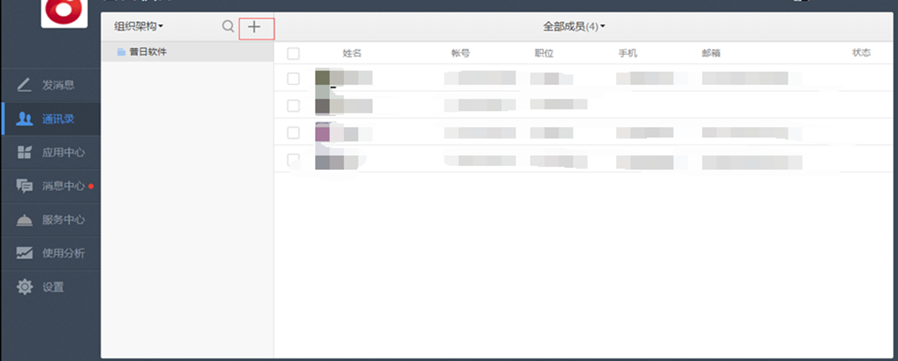
####填写成员信息
 每个成员的必填信息都需要填写，尤其需要注意的是【账号】一项，此字段需要填写对应人员通过查询数据库中的（**SECURITY_USERS_C 表中的成员对应的ID字段。不是EXTEND_ID字段**）
 
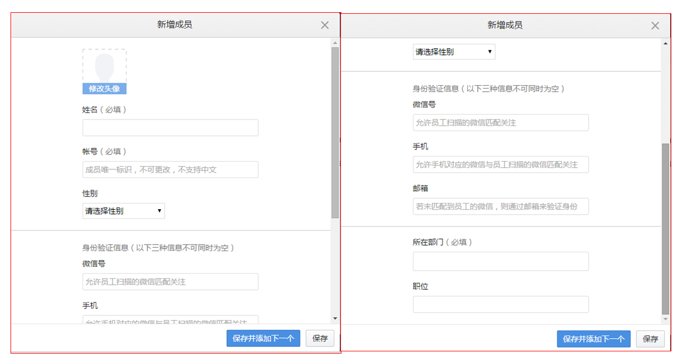
####点击左侧的树文件最后一个选项【设置】，然后在右侧点击【权限管理】
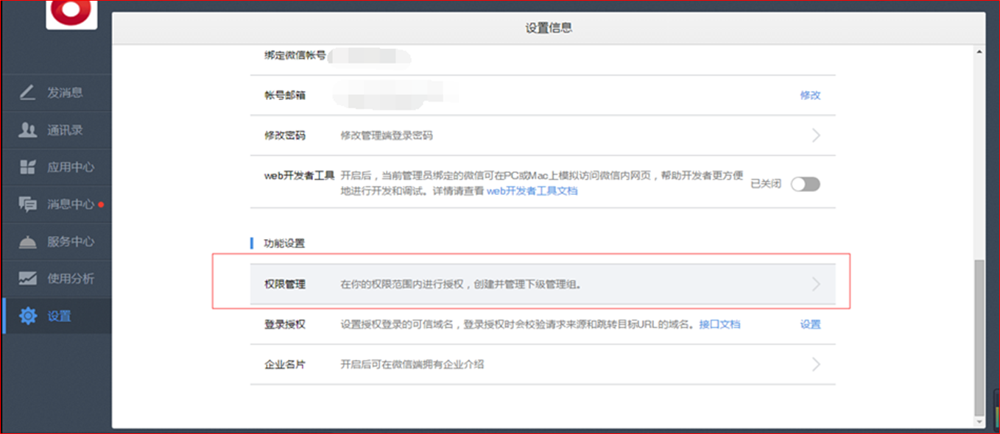
####创建管理组
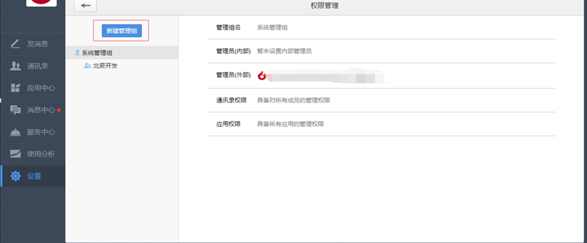
####填写管理组信息
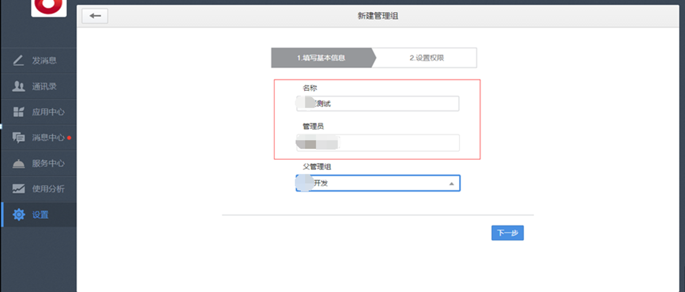
####对管理员用户进行【通讯录权限】授权和【应用权限】授权

####点击保存，创建成功
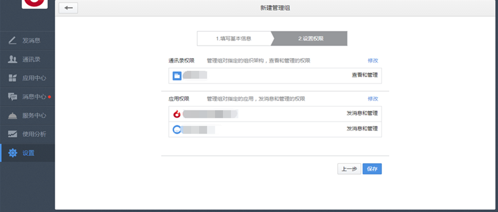

  [回到首页](#home)

微信客户端部署 - 通讯录组织结构以及导入导出
===

说明
--
####因为目前只对通讯录中的人员信息进行了同步，并没有对组织机构进行维护，所以需要实施人员将所有人员信息都创建在一个组织架构中，如果客户通讯录中已经存在信息，则可以利用通讯录的导入导出功能，将人员信息重新导入到一个组织架构中，一般以最根部的组织架构作为维护的组织架构。导入导出的结构请参照通讯录中的示例。在导入时需要注意，【账号】字段需要与数据库中的（SECURITY_USERS_C 表中的成员对应的ID字段）一致。

  [回到首页](#home)

微信客户端部署 - xxxqyweixinoa微信工程的配置文件
===

说明
--
####- 配置文件位置：
	xxxweixinqyoa\WEB-INF\classes\conf.properties

####1.proxy\_base_url为mobile-platform的IP地址
####2.proxy\_base_domain为域名
####3.weixin\_corpid、weixin\_corpsecret、weixin\_token、weixin\_encodingaeskey、weixin_agentid为微信工程重要的通信参数，获取这些参数需要管理员登录微信企业号管理平台，获取位置参照下图：

PS:在设置Token和EncodingAESKey的时候可以使用随机生成的字符串，但是需要现场实施人员记录到微信工程的配置文件conf.properties中，此时点击认证是不会成功的，此时只需在配置文件conf.properties中配置好相关参数，配置好参数后启动微信工程，再做验证。详细做法请参照[微信客户端部署注意事项](#attention)中的回调模式验证，验证通过后才能正常使用！！！

####4.weixin_department参数为部门ID，管理员可以在微信企业号管理平台的【通讯录】中【组织架构】中点击右侧的小三角，然后点击【修改部门】即可看到对应的部门ID值。
####（注:因为目前没有将企业的内部组织架构放在微信企业号中进行维护，现在的处理方式是把所有的人员都放在一个组织架构中。）

  [回到首页](#home)

微信客户端部署 - home工程的配置文件
===

说明
--
####- 需要执行SQL：
	 comment on column hr\_personnel_person.column1 is '微信号';
####在整合后的home文件中，只有一个配置文件，路径为：
	webapps/home/WEB-INF/classes/conf.properties
####修改的配置配件内容（如果提交到现场的部署文件中没有weixinHttpUrl，需要向提交部署文件的人员进行说明，并要求其提供该参数）：
	weixinHttpUrl=http://xxx.xxx.xxx.xxx/***weixinqyoa/weixincore
####其中xxx.xxx.xxx.xxx更换为现场用户微信端服务器的微信内网ip地址
####home工程中推送相关的配置请参照[微信客户端部署注意事项](#attention)中的推送相关配置。

  [回到首页](#home)

微信客户端部署 - messagemanagement工程的配置文件
===

说明
--
	#rmi端口号_提供rmi推送服务的端口号
	platform.rmi.port=1199
	#add by wanghe 微信推送相关 start
	#微信推送模式(1:不推送,2:推送)_部署工程时需要根据实际情况设定
	weixin_model = 2
	#微信推送域名地址（即微信工程服务器公网IP绑定的域名地址）
	weixin_domain = http://xxx.xxx.xx
	#微信推送工程地址（即xxxweixinqyoa其中xxx是各个项目具体的微信客户端前缀）
	weixin_push_path = /xxxx
	# add by wanghe 微信推送相关 end

####推送功能相关的关键在于rmi_host以及rmi_port这两个参数在home工程以及messagemanagement工程中的设置，详情请参照[微信客户端部署注意事项](#attention)中的推送相关配置。
  [回到首页](#home)

微信客户端部署 - mobile-platform工程的配置文件
===

说明
--
mobile-platform由各个项目的开发者提供，相应的配置参数由现场部署文件提供者提供。 与微信相关的配置参数主要是platform.rmi.host以及platform.rmi.port两个参数,关于这两个参数的配置请参照[微信客户端部署注意事项](#attention)中的推送相关配置。

  [回到首页](#home)

通过企业协同管理平台同步到微信企业号通讯录
===
介绍
--
&nbsp;&nbsp;&nbsp;&nbsp;&nbsp;&nbsp;&nbsp;企业微信号的通讯录是企业与企业成员交互的重要工具和依赖，企业微信号的通讯录有一个企业微信号中的成员唯一标识，即人员通讯录中的【**账号**】信息，它支持对多64位字节的字符串，这个字段是与企业成员交互的凭证，因此必须保证该字段的**唯一性**。目前已经将与微信通讯录的同步操作集成在医院协同管理平台中了，在进行人员信息管理时会将相应的操作同步到微信通讯录中。

PC端与微信端同步
--
&nbsp;&nbsp;&nbsp;&nbsp;&nbsp;&nbsp;&nbsp;因为医院协同管理平台的人事管理员在对人事信息进行维护时可能会出现与微信服务器之间的通讯障碍或者没有能够与微信通讯录同步成功的情况存在。因此在保存维护后的人员信息时可能会有错误提示，**这种情况出现的概率非常低，但是如果出现了，管理员需要参照以下的引导作出相应的处理：**

**PC端与微信端同步失败会提示：“保存成功！微信端同步失败，请联系系统管理员！”**

######1.用户管理中
######点击"新增院内人员"按钮，提示该错误信息，管理员需要检查微信端网络情况，并登陆微信公众管理平台手动在通讯录中添加该用户的微信信息，新增用户的账号信息需要管理员查询数据库中的（SECURITY\_USERS_C 表中的成员对应的ID字段）。若“邀请关注”按钮可点击，则点击邀请该用户关注。

######2.用户管理中
######点击"删除"按钮，提示该错误信息，管理员需要检查微信端网络情况，并登陆微信公众管理平台手动删除通讯录中该用户的微信信息。

######3.员工信息中
###### - 3.1 点击”修改"按钮，微信号从无到有，提示该错误信息，管理员需要检查微信端网络情况，登陆微信公众管理平台手动在通讯录中添加微信号，若“邀请关注”按钮可点击，则点击邀请该用户关注员工信息中。
###### - 3.2点击"修改"按钮，微信号从有到有，提示该错误信息，请多次尝试修改仍未成功，管理员需要检查网络状态或更改微信号重新提交员工信息中。
###### - 3.3点击"修改"按钮，微信号从有到无，提示该错误信息，管理员需要检查微信端网络情况，登陆微信公众管理平台手动在通讯录中删除微信号。

######4.录聘管理中
###### - 4.1 点击"离职人员录聘"按钮，提示该错误信息，管理员需要检查微信端网络情况，并登录微信公众管理平台，设置该用户为启用，若“邀请关注”按钮可点击，则点击邀请该用户关注。
###### - 4.2 点击"返聘"按钮，提示该错误信息，请检查微信端网络情况，并登录微信公众管理平台，设置该用户为启用，若“邀请关注”按钮可点击，则点击邀请该用户关注。

######5.离院管理中
######点击“新增”按钮，提示该错误信息，管理员需要检查微信端网络情况，并登录微信公众管理平台，设置该用户为禁用。

  [回到首页](#home)

微信客户端部署注意事项
===
###1 - 需要一个有公网IP和内网IP的机器
###2. - 需要有映射到该服务器公网IP的域名
###3 - 微信工程名为xxxweixinqyoa（xxx是各个项目具体的微信客户端前缀）
###4 - JDK版本建议1.6
###5 - 需要一个单独运行的80端口的tomcat
###6 - 启动tomcat后，需要在企业号应用中进行回调模式的验证
###7 - 回调模式的验证：需要特殊强调一下回调模式的验证：需要管理员用户登录到微信企业号管理平台，然后点击【应用中心】->选择想要验证的应用->【回调模式】->【回调URL及密钥】修改 -> 将配置文件中的回调URL及密钥填写到对应位置（注：回调URL为 http:// 域名 + /xxxweixinqyoa/weixincore/api） -> 验证成功 
#####在验证时需要做特殊处理，需要注意：调用过程中可能会出现java.security.InvalidKeyException:illegal Key Size的异常

#####解决方法：

#####在官方网站下载JCE无限制权限策略文件

#####请到官网下载对应的版本。

#####例如JDK7的下载地址：

#####[JDK7官方网站JCE无限制权限策略文件下载](http://www.oracle.com/technetwork/java/javase/downloads/jce-7-download-432124.html)

#####例如JDK6的下载地址：

#####[JDK6官方网站JCE无限制权限策略文件下载](http://www.oracle.com/technetwork/java/javase/downloads/jce-6-download-429243.html)

#####下载后解压，可以看到local_policy.jar和US_export_policy.jar以及readme.txt。

#####如果安装了JRE，将两个jar文件放到%JRE_HOME% \lib\security

#####目录下覆盖原来的文件，

#####如果安装了JDK，将两个jar文件放到%JDK_HOME%\jre\lib\security目录下覆盖原来文件。  
###8 - 在企业微信号客户端，管理员输入"createMenu"创建菜单，如果收到"创建菜单成功"则表示创建菜单成功  

###9 - 推送相关配置：
####1.rmi_port参数
#####- home工程中proper_platform_rmi_port(Linux系统路径：tomcat/bin/catalina.sh | windows系统路径:tomcat/bin/catalina.bat)。  - mobile-platform工程中的配置文件中的参数:platform.rmi.port  以上两个参数需要与messagemanagement工程(视为服务端)中的conf.properties中的参数platform.rmi.port一致(路径: messagemanagement/WEB-INF/classes)
####2.rmi_host参数
#####- home工程中需要确认参数 proper_platform_rmi_host(Linux系统路径：tomcat/bin/catalina.sh | windows系统路径:tomcat/bin/catalina.bat)。  - mobile-platform工程中的tomcat中的参数-Djava.rmi.server.hostname 以及 proper_platform_rmi_host参数(Linux系统路径：tomcat/bin/catalina.sh | windows系统路径:tomcat/bin/catalina.bat)  - 以上两个参数应该设置为messagemanagement工程所在服务器的内网IP地址

###10 - 需要与提供者确认messagemanagement工程以及mobile-platform工程是否为完整工程，验证标准为正确配置后在WEB端的OA正常流程创建人员并上岗,保证该人员已经被正常加入到微信企业号通讯录中，使用一个已有账号向该人员发送邮件，该人员微信能够收到推送，并且点击能够查看邮件内容。
  [回到首页](#home)

